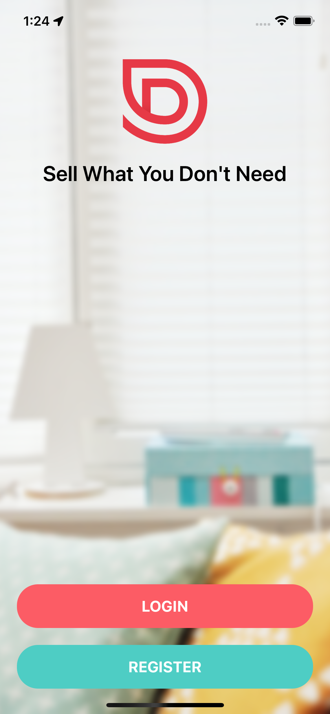
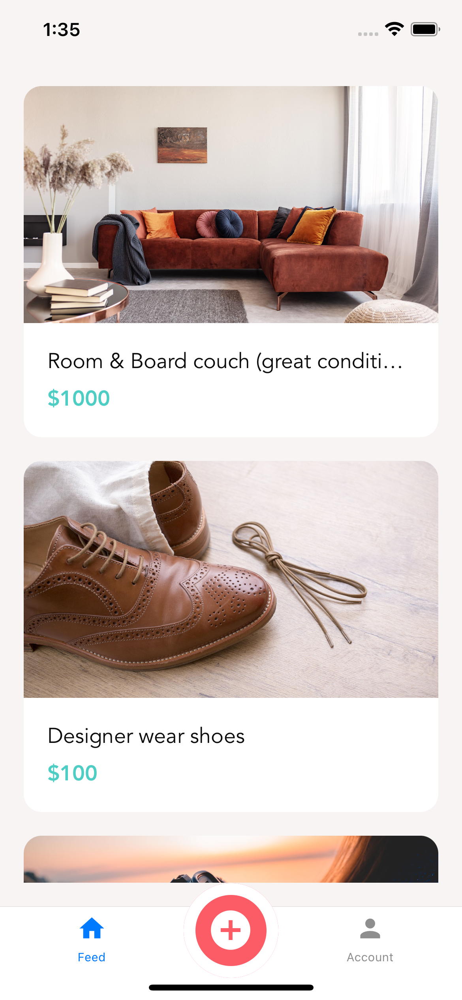
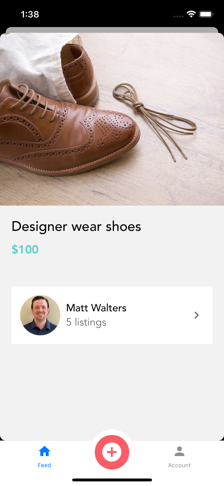
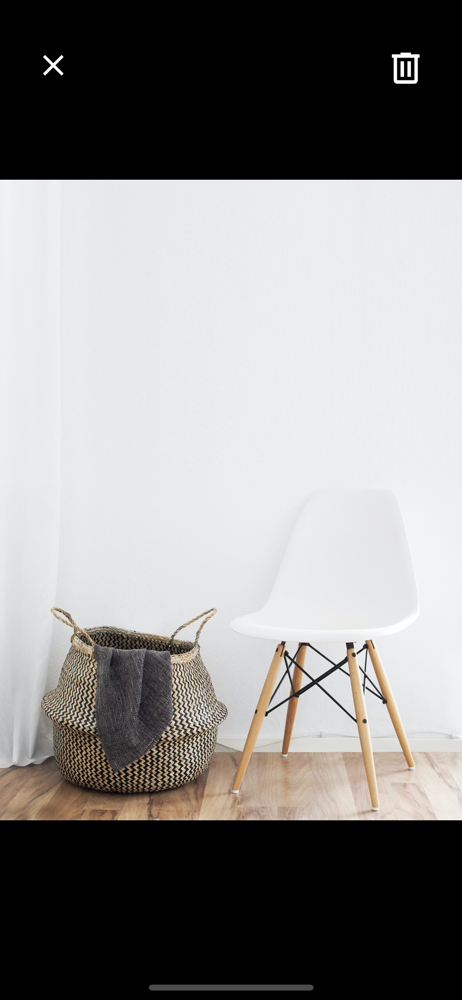
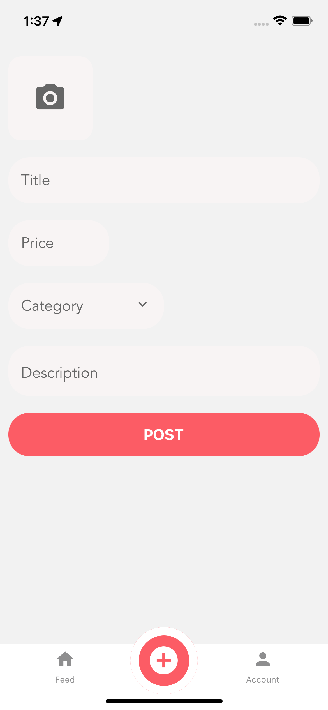
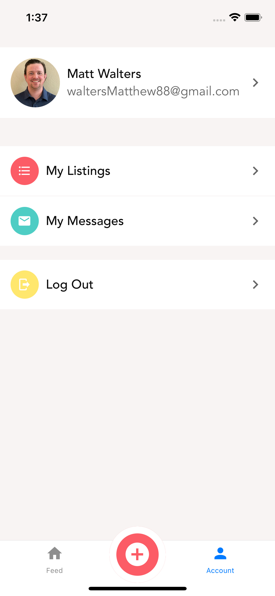
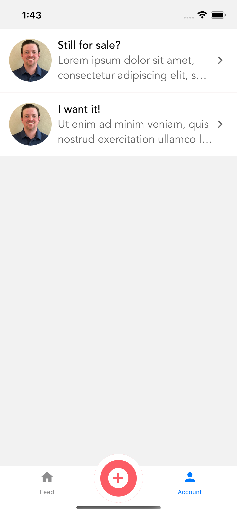

# DoneWithIt

## Project Idea and Description

DoneWithIt is a native app designed to help people buy and sell used items on a virtual marketplace. Users can create an account, post items with pictures prices and descriptions, and browse other users' listings.

## Userstories

As a user, I want to be able to...

-   create an account
-   create a listing (title, photos, details, price)
-   message a listing owner for more details
-   remove a listing/mark as sold
-   edit my existing account details

## Tech stack

-   React
-   React Native
    -   gesture-handler
    -   progress
    -   reanimated
    -   safe-area-context
    -   screens
-   Expo
    -   image-picker
    -   location
    -   permissions
    -   status bar
-   React-navigation
    -   bottom-tabs
    -   native-stack
    -   stack
-   APIsauce
-   Formik
-   Community-icons
-   Lottie
-   Yup
-   iOS and Android emulator
-   Node.js

## screenshots

    

        <em>Welcome Screen</em>
         
        
    

    &nbsp;
    

        <em>Login Form</em>
         
        
    

    &nbsp;
    

        <em>Listings Feed</em>
         
        
    

    &nbsp;
    

        <em>Listing Detail</em>
         
        
    

    &nbsp;
    &nbsp;
    

        <em>View Image</em>
         
        
    

    &nbsp;
    

        <em>New Listing Form</em>
         
        
    

    &nbsp;
    

        <em>Account Screen</em>
         
        
    

    &nbsp;
    

        <em>Messages Screen</em>
         
        
    

    &nbsp;

<!-- (./app/assets/screengrabs/welcome.png) -->

## MVP Goals

-   Create all screens and reusable components
-   Use cohesive design system
-   Implement StackNavigator to move between screens
-   Ability to add photos to listings

## Stretch Goals

-   Use gesture-handler to add swipeable components
-   Implement fullstack functionality (post to database, call database to populate feed)
-   Deploy app
-   Deploy to respective app stores
